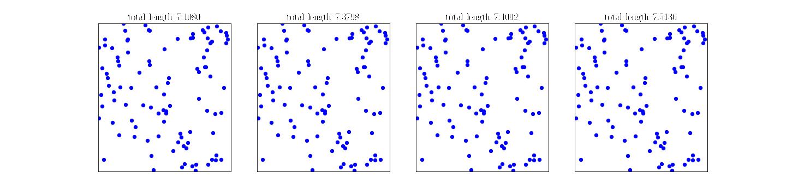

# Winner Takes It All: Training Performant RL Populations for Combinatorial Optimization

---

This repository contains the official JAX implementation of the paper [Winner Takes It All: Training Performant RL
Populations for Combinatorial Optimization](https://arxiv.org/abs/2210.03475).

---

## Overview :hibiscus:
Though applying reinforcement learning to combinatorial optimization is attractive, it is unrealistic to expect an agent 
to solve these (often NP-)hard problems in a single shot due to their inherent complexity.
Poppy is a method that uses a _population_ of agents with suitably diverse policies to improve the exploration of the
solution space of hard _combinatorial optimization_ problems, such as 
[TSP](https://en.wikipedia.org/wiki/Travelling_salesman_problem), 
[CVRP](https://en.wikipedia.org/wiki/Vehicle_routing_problem) or 
[Knapsack](https://en.wikipedia.org/wiki/Knapsack_problem). To this end, it uses a new RL objective to induce an 
unsupervised specialization targeted solely at maximizing the performance of the whole population.

<p align="center">
    <a href="img/tsp.gif">
        
    </a>
    <i>Figure 1: A diverse set of TSP solvers taking different routes in a given instance.</i>    
</p>

## Getting Started :rocket:
### Installation

A Dockerfile is provided to run the code. Currently, the installation uses [JAX](https://jax.readthedocs.io/en/latest/), 
which enables to run our models seamlessly across different hardware (CPU, GPU, TPU). To build the Docker image, start a
container, and enter it, run the following from the root directory of the repository.

```shell 

# Build the container (TPU)
make docker_build_tpu

# Build the container (CPU or GPU, untested)
make docker_build_local

# Start the container
make docker_start

# Get in the container
make docker_enter
```

_Note that the command for building the Docker image changes depending on the hardware being used (CPU, GPU or TPU)._

### Training 
The models can be trained using the `experiments/train.py` script by executing:
```shell
python experiments/train.py
```
Configs management is done with Hydra, but it can be changed to CVRP for example with `--config-name config_exp_cvrp`.
The most important parameters are: 

```yaml

num_steps: 1000                 # Number of training steps
validation_freq: 500            # Every how many steps validation runs

pop_size: 1                     # Population size (e.g. 1, 4, 8, 16, 32)
num_starting_positions: 20      # Number of starting points (must lower or equal than the problem size)
loss_objective: 'pomo'          # "pomo" for single-decoder, "poppy" or "poppy_with_pomo_baseline" for multi-decoder

batch_size: 64                  # Batch size (number of problems for each training step)

checkpointing:
    save_checkpoint: True           # Whether to save checkpoints
    keep_best_checkpoint: False     # Whether to save a new checkpoint upon achieving best performance (o.w. save the last one)
    
    restore_path: ""                # Path to a checkpoint to be loaded (empty string -> do not load anything)
    load_decoder: True             # Whether to load the decoder(s) from the checkpoint
    allow_cloned_across_population: False  # Whether to allow the same decoder to be cloned across the population
```

#### Training Pipeline
The training of our models is divided into 2 phases, as explained in the paper. We briefly describe here which
parameters should be used in each of these phases for a (final) 4-agent population:
1. Train a single-decoder architecture (i.e. single agent) is trained from scratch.
```yaml
pop_size: 1
loss_objective: 'pomo'
restore_path: ""
```

2. The trained decoder is discarded and a population of decoder heads is randomly initialized. With the parameters of 
the shared encoder frozen, the decoders are trained in parallel using the same training instances.
```yaml
pop_size: 4
loss_objective: 'poppy' # (or 'poppy_with_pomo_baseline')
checkpointing:
    restore_path: "path to the checkpoint produced in Phase 1"
    allow_cloned_across_population: True
```

### Testing
* The evaluation sets for TSP100 and CVRP100 are due to [Kool et al.](https://github.com/wouterkool/attention-learn-to-route).
* The evaluation sets for TSP125, TSP150, CVRP125 and CVRP150 are due to [Hottung et al.](https://arxiv.org/pdf/2106.05126.pdf).
* The evaluation set for Knapsack has been produced by us.

We describe two ways of evaluating the models below.

#### Greedy Evaluation
This evaluation runs the greedy policy (i.e. the action with the highest probability is selected). The trained models 
can be tested using the `experiments/validate.py` script by executing the command below:
```shell
python experiments/validate.py
```
where
* `env` - Name of the environment (`cvrp`, `knapsack` or `tsp`).
* `problem_size` - Size of the problem (number of nodes in CVRP, number of items in Knapsack and number of cities in TSP).
The problem sizes we have test sets for are: 100, 125 and 150 for CVRP and TSP, and 100 and 200 for Knapsack.
* `pop_size` - Population size with which the model was trained.
* `model_path` - Path to the model's folder (i.e. a checkpoint generated with the training code).

After a variable amount of time, the script will output the corresponding performance metric (e.g., tour length in TSP).

#### Sampling Evaluation
This evaluation runs stochastic rollouts for the best <agent, starting point> pairs. First, a greedy rollout is run on 
each starting position for each agent. Second, the best pairs are selected (as many as agents) and 200 stochastic
rollouts are run for each of them. The best performance is then returned.

The trained models can be tested using the `experiments/slowrl_validation.py` script.
where the parameters are like those for the greedy evaluation.

## Reference :pencil2:
If you find this repository useful in your work, please use the following citation:

```
@inproceedings{grinsztajn2023population,
  author    = {Grinsztajn, Nathan and Furelos-Blanco, Daniel and Surana, Shikha and Bonnet, Cl{\'{e}}ment and Barrett, Thomas D.},
  title     = {Winner Takes It All: Training Performant RL Populations for Combinatorial Optimization},
  booktitle = {Advances in Neural Information Processing Systems},
  year      = {2023}
}
```

## Acknowledgements :pray:
This research has been supported with TPUs from [Google's TPU Research Cloud (TRC)](https://sites.research.google/trc/).